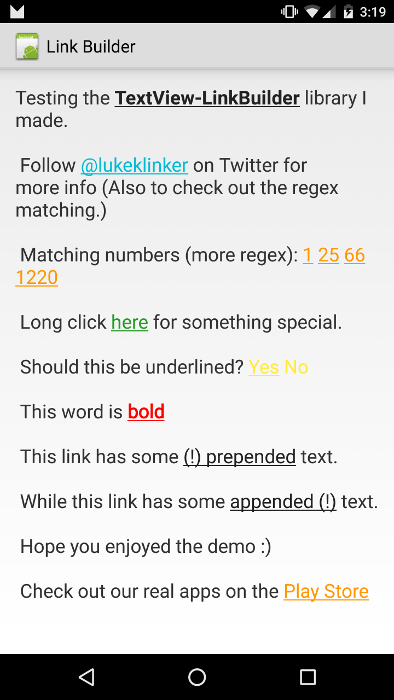

# Android TextView-LinkBuilder [](https://android-arsenal.com/details/1/2049)



Insanely easy way to create clickable links within a `TextView`. 

While creating [Talon for Twitter](https://github.com/klinker24/Talon-for-Twitter), one of the most difficult things I encountered was creating these clickable links based on specific text. Luckily, I have made it easy for anyone to apply this type of style to their `TextView`'s.

## Features

Similar to how all the big players do it (Google+, Twitter, *cough* Talon *cough*), this library allows you to create clickable links for any combination of `String`s within a `TextView`.

 - Specify long and short click actions of a specific word within your `TextView`
 - Provide user feedback by highlighting the text when the user touches it
 - Match single `String`s or use a regular expression to set clickable links to any text conforming to that pattern
 - Change the color of the linked text
 - Change the color of the linked text when the user touches it
 - Modify the transparency of the text's highlighting when the user touches it
 - Set whether or not you want the text underlined
 - Set whether or not you want the text bold
 - Default link color from an activity theme

The main advantage to using this library over `TextView`'s autolink functionality is that you can link anything, not just web address, emails, and phone numbers. It also provides color customization and touch feedback.

## Installation

There are two ways to use this library:

#### As a Gradle dependency

This is the preferred way. Simply add:

```groovy
dependencies {
    compile 'com.klinkerapps:link_builder:1.3.3'
}
```

to your project dependencies and run `gradle build` or `gradle assemble`.

#### As a library project

Download the source code and import it as a library project in Eclipse. The project is available in the folder **library**. For more information on how to do this, read [here](http://developer.android.com/tools/projects/index.html#LibraryProjects).

## Example Usage

Functionality can be found in the example's [MainActivity](https://github.com/klinker24/Android-TextView-LinkBuilder/blob/master/example/src/main/java/com/klinker/android/link_builder_example/MainActivity.java)

For a list of regular expressions that I use in Talon, you can go [here](https://github.com/klinker24/Talon-for-Twitter/blob/master/src/main/java/com/klinker/android/twitter/utils/text/Regex.java)

```java
// Create the link rule to set what text should be linked.
// can use a specific string or a regex pattern
Link link = new Link("click here")
    .setTextColor(Color.parseColor("#259B24"))                  // optional, defaults to holo blue
    .setTextColorOfHighlightedLink(Color.parseColor("#0D3D0C")) // optional, defaults to holo blue
    .setHighlightAlpha(.4f)                                     // optional, defaults to .15f
    .setUnderlined(false)                                       // optional, defaults to true
    .setBold(true)                                              // optional, defaults to false
    .setOnLongClickListener(new Link.OnLongClickListener() {
        @Override
        public void onLongClick(String clickedText) {
        	// long clicked
        }
    })
    .setOnClickListener(new Link.OnClickListener() {
        @Override
        public void onClick(String clickedText) {
        	// single clicked
        }
    });

TextView demoText = (TextView) findViewById(R.id.test_text);

// create the link builder object add the link rule
LinkBuilder.on(demoText)
    .addLink(link)
    .build(); // create the clickable links
```

With version 1.1.0, you can create a `CharSequence` from a `String` instead of creating and applying the links directly to the `TextView`. Do not forget to set the movement method on your `TextView`'s after you have applied the `CharSequence`, or else the links will not be clickable.

```java
// find the text view. Used to create the link builder
TextView demoText = (TextView) findViewById(R.id.test_text);

// Add the links and make the links clickable
CharSequence sequence = LinkBuilder.from(this, demoText.getText().toString())
    .addLinks(getExampleLinks())
    .build();

demoText.setText(sequence);

// if you forget to set the movement method, then your text will not be clickable!
demoText.setMovementMethod(TouchableMovementMethod.getInstance());
```

If you would like to set the default text color for links without inputting it manually on each `Link` object, it can be set from the activity theme.

```xml
<style name="LinkBuilderExampleTheme" parent="android:Theme.Holo.Light">
    <item name="linkBuilderStyle">@style/LinkBuilder</item>
</style>
<style name="LinkBuilder">
    <item name="defaultLinkColor">#222222</item>
    <item name="defaultTextColorOfHighlightedLink">#444444</item>
</style>
```

## Usage with ListView.OnItemClickListener

By default, `LinkBuilder` will consume all the touch events on your `TextView`. This means that `ListView.OnItemClickListener` will never get called if you try to implement it. The fix for this is to implement the `LinkConsumableTextView` rather than the normal TextView in your layouts.

My `LinkConsumableTextView` will only consume touch events if you have clicked the link within the `TextView`. Otherwise, it will defer the touch event to the parent, which allows you to use `ListView.OnItemClickListener` method.

## Contributing

Please fork this repository and contribute back using [pull requests](https://github.com/klinker24/Android-TextView-LinkBuilder/pulls). Features can be requested using [issues](https://github.com/klinker24/Android-TextView-LinkBuilder/issues). All code, comments, and critiques are greatly appreciated.

## Changelog

The full changelog for the library can be found [here](https://github.com/klinker24/Android-TextView-LinkBuilder/blob/master/changelog.md).


## License

    Copyright 2015 Luke Klinker

    Licensed under the Apache License, Version 2.0 (the "License");
    you may not use this file except in compliance with the License.
    You may obtain a copy of the License at

       http://www.apache.org/licenses/LICENSE-2.0

    Unless required by applicable law or agreed to in writing, software
    distributed under the License is distributed on an "AS IS" BASIS,
    WITHOUT WARRANTIES OR CONDITIONS OF ANY KIND, either express or implied.
    See the License for the specific language governing permissions and
    limitations under the License.
